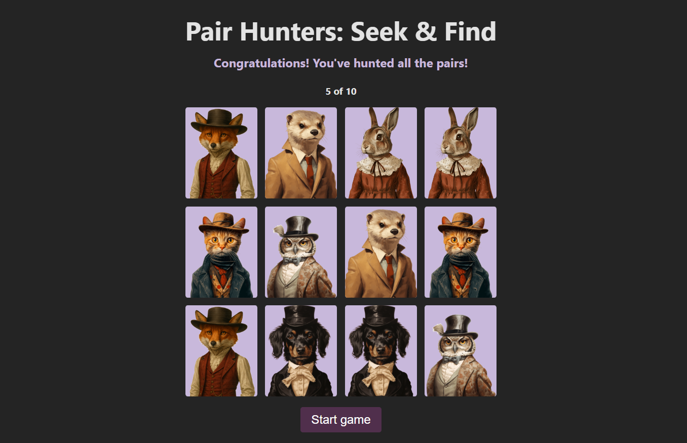

# Pair Hunters - Memory Game



A classic card matching memory game built with modern web technologies. Flip cards, find pairs, and test your memory before you run out of attempts!

## Features

- Interactive card flipping animations.
- Match pairs of identical cards.
- Limited attempts (10) to add a challenge.
- Tracks the number of attempts made.
- Displays game status messages (Start, Playing, Win, Game Over).
- Celebratory fireworks animation upon winning using `canvas-confetti`.
- Responsive design.

## Technologies Used

- HTML5
- CSS3
- TypeScript
- Vite (as the build tool/dev server)
- canvas-confetti (for the winning animation)

## Live Demo

[https://gustedeveloper.github.io/Pair-hunters/]

## Installation and Setup

To run this project locally:

1.  **Clone the repository:**
    ```bash
    git clone git@github.com:gustedeveloper/Pair-hunters.git
    cd Pair-hunters
    ```
2.  **Install dependencies:**
    ```bash
    npm install
    # or
    # yarn install
    ```
3.  **Run the development server:**
    ```bash
    npm run dev
    # or
    # yarn dev
    ```
4.  Open your browser and navigate to the local URL provided by Vite (usually `http://localhost:5173`).

## How to Play

1.  Click the "Start Game" button.
2.  Click on any card to flip it over.
3.  Click on a second card to see if it's a match.
4.  If the cards match, they stay face up.
5.  If they don't match, they will flip back face down after a short delay, and your attempt count increases.
6.  Continue matching pairs until all cards are face up.
7.  You win if you match all pairs within 10 attempts.
8.  You lose if you run out of attempts before matching all pairs.
9.  Click "Start Game" again to play a new round.

## Author

- **gustedeveloper** - [https://www.linkedin.com/in/gustegaubaite/]
